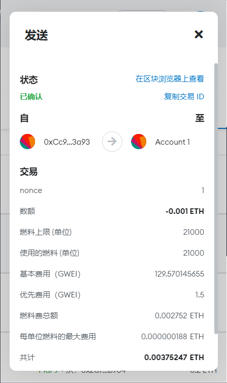

# w1-1

https://goerli.etherscan.io/tx/0x8e5ff7fdefaca30ea18017d08569ba4fdb92b9e83bd1cbcc517ae12bae9d7ea7

```solidity
// SPDX-License-Identifier: GPL-3.0

pragma solidity >=0.8.2 <0.9.0;

contract Counter {

    uint256 number;

    function add(uint256 num) public {
        number = number + num;
    }
    function getNum() public view returns (uint256){
        return number;
    }
}
```

交易：https://goerli.etherscan.io/tx/0xc468ae99e02109a221e6dfcc86d67ec235ffd6879a127c9f73424d86e93c6feb

